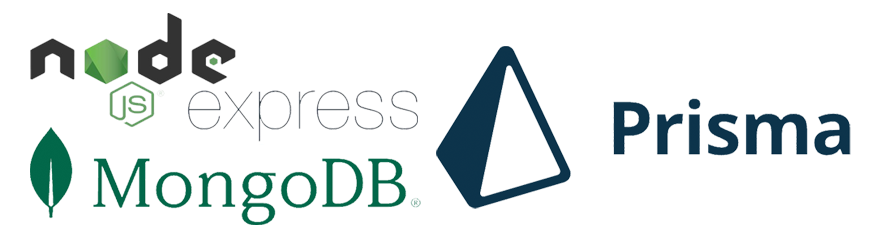
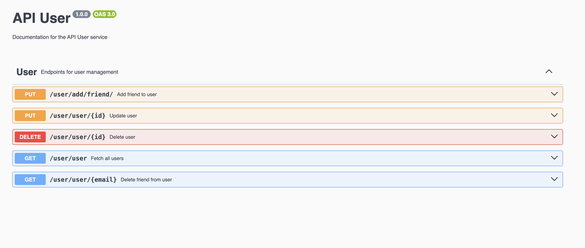

<h1 align="center"><strong> TalkAway User API</strong></h1>


<br />
<div align="center"><h2>🚀 Cet Api est construit avec la stack : Node js - Express - MongoDB - Prisma </h2></div>

<h1 align="center">



</h1> 


## Fonctionnalités

- **Gestion des user**


## Installation

Installer les dépendences du projet

```sh
npm install 
```

Créer le fichier  .env et ajouter la connexion a la base de données et le numero du port 

```sh
# Access a la base de donnees
DATABASE_URL="mongodb+srv://xxx:<password>@instance.grqtqqa.mongodb.net/?retryWrites=true&w=majority"

# Numero du port
PORT=3005
```

Démarrer le projet en mode dev

```sh
npm run dev
```

Exécuter les tests

```sh
npm run test
```


## Documentation de l'Api
Pour accéder à la documentation,
```sh
# Tapper  l'url suivant dan votre navigateur

http://localhost:3005/api-docs/
```
<h1 align="center">



</h1>